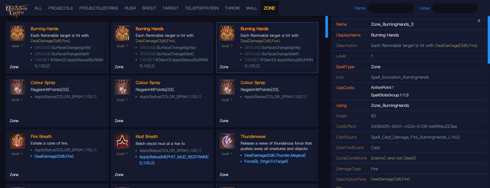

# Baldur's Gate 3 Spells
## Display the stats of spells

### [Preview Online](https://bg3.ivi.cx)

### build local
1. `pnpm i`
2. use [BG3-Modders-Multitool](https://github.com/ShinyHobo/BG3-Modders-Multitool) extract files.
3. edit `cfg.js`
4. run `pnpm run build`

The build files will be list at the `dist` folder.