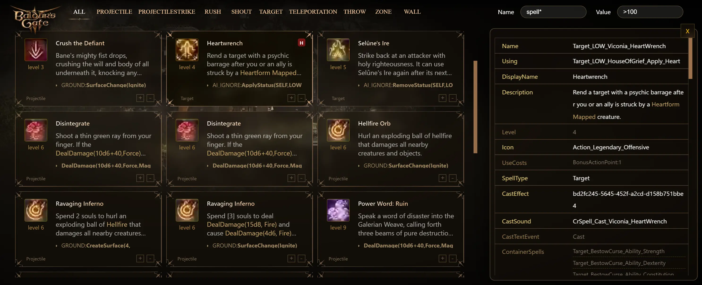
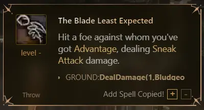

# Baldur's Gate 3 Spells
Display and filter the stats of spells

### [Preview Online](https://bg3.ivi.cx)



### build
1. `pnpm i`
2. use [BG3-Modders-Multitool](https://github.com/ShinyHobo/BG3-Modders-Multitool) extract files.
3. edit `cfg.js`
4. run `pnpm run 'update spells'` to generate static js and images
5. run `pnpm run build`

The build files will be list at the `dist` folder.


### Usage
#### Filter Spells
The upper right filter supports Regex and is case-insensitive.

- Name 
    - The Property name of spell's data.
    - `spell*` means start width spell. Or, you can type /^spell/.
  
- Value:
    - The Property Value of spell's data .
    - '-' means empty.
    - '*' means not empty.
    - '>5' means equal or bigger than 5.

e.g

```
-- List No Icon spells:
Name: icon   Value: -

-- List Honour spells:
Name: mod   Value: ho

-- List Spells with Damage > 500:
Name: spell*   Value: >500
```


#### Copy command
Click in the lower right corner of the card, 
you can copy the `AddSpell` and `RemoveSpell` commands


